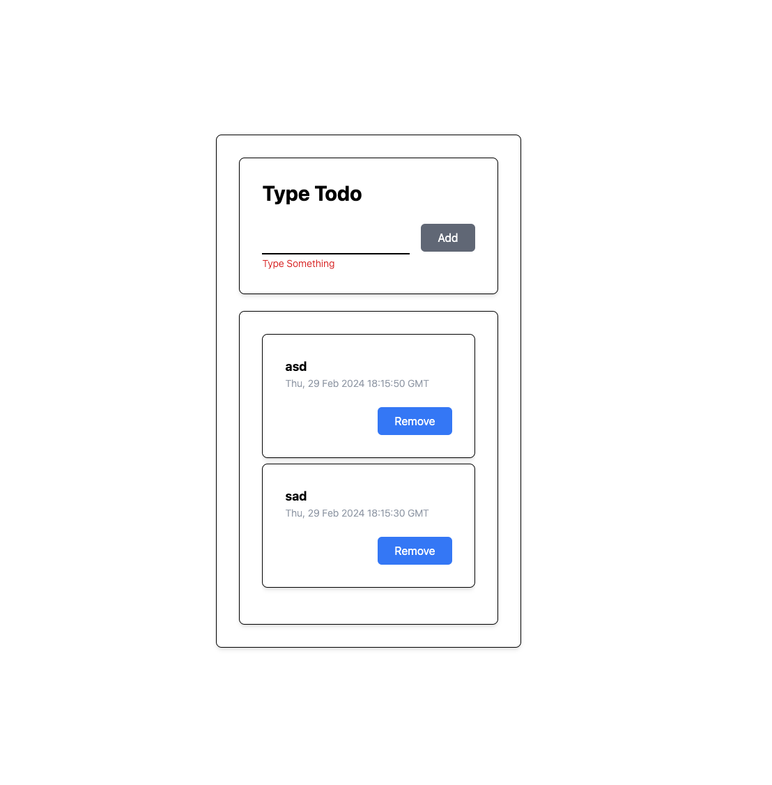

# wanted-pre-onboarding-frontend-challenge-19

## Author: Keepgo

## 목록
- 안내사항
- 과제 공통 세팅
- 과제 1
- 과제 2

## 안내사항
과제 세팅에 맞춰 과제를 수행해주세요. 세팅값에 맞지 않는 프로젝트는 과제 확인이 불가능합니다. 과제 제출 전에 확인하고 제출 부탁드립니다.

- [x] 과제 제출 최상단에 개인 이력서 주소 첨부해주세요.
- [x] create-react-app 혹은 vite으로 프로젝트를 생성합니다.
- [x] 아래 과제 공통 세팅의 폴더 구조를 확인합니다.
- [x] 과제를 제출하는 방법은 본인이 작업한 github repository 주소를 [issues](https://github.com/summerdidi/wanted-pre-onboarding-frontend-challenge-19/issues)에 올리면 됩니다.
- [x] 과제물은 main 브랜치에 올립니다.
- [x] 프로젝트는 node version 20에서 실행할 수 있어야합니다.
- [x] Settings -> Codespaces -> Configuration Select branch를 main 으로 하고 제출합니다.(codespace 확인용도)
- [x] 함수형 컴포넌트를 사용해 코드를 짜주세요.

## 과제 1 todo list 만들기
Add와 Delete 기능 2 가지를 만듭니다.
1. input 창에 list1을 입력 후 Add 버튼을 누르면 input 창 하단에 list1 컴포넌트가 뜹니다.
2. 각 list의 delete 버튼을 누르면 해당 list 컴포넌트가 삭제됩니다. 

- 디자인은 자유롭게 해도 됩니다. 위의 2가지 버튼과 그에 따른 기능이 있으면 됩니다.
- 가능하면 컴포넌트를 만듭니다. (작은 단위라도 좋습니다.)
- 전역상태를 관리해주세요.(가능한 Redux나 Redux-toolkit을 이용해주세요.)

## 과제 2
질문을 읽고 답해주세요. 본인이 알고 있는 만큼 답변해주시면 됩니다. 

issue에 제출

